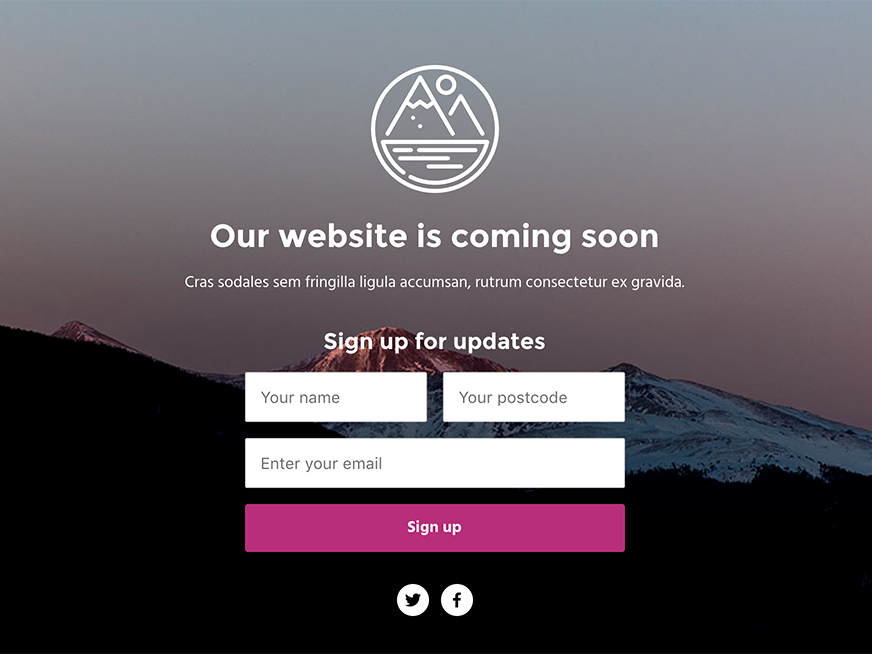

# Landing Page Theme

A landing theme for Rusic that provides email signup with a referral mechanic.



## Setup

Copy `.rusic.yml.example` to `.rusic.yml` and configure it for the environments
you want to deploy to. If you’re stuck, please refer to the gem’s configuration
[instructions](https://github.com/rusic/rusic-gem#deploy-using-a-rusicyml-file).

Install development dependencies with `yarn` (or `npm`).

```sh
$ yarn install
```

Install deployment dependencies with `bundle`.

```sh
$ bundle
```

## Development

You can build the Sass or watch _and_ build.

```sh
$ yarn run sass
$ yarn run watch
```

## Deployment

Using the [Rusic gem](https://github.com/rusic/rusic-gem), deploy the theme to
your desired environment. You can also watch for changes and continuously
deploy.

```sh
$ rusic deploy <environment>
$ rusic deploy <environment> --watch
```

## TL;DR


